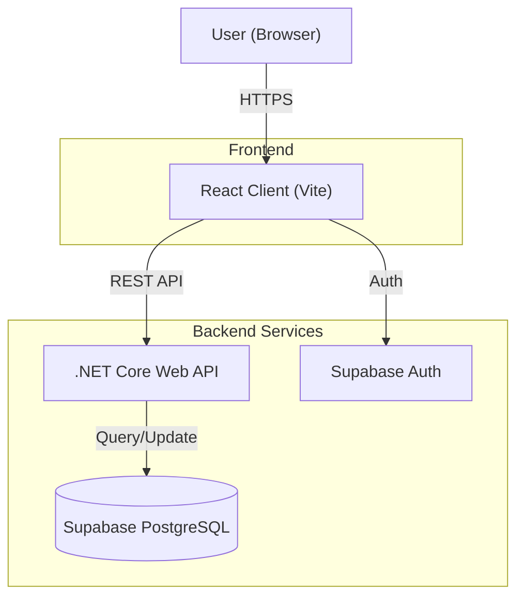
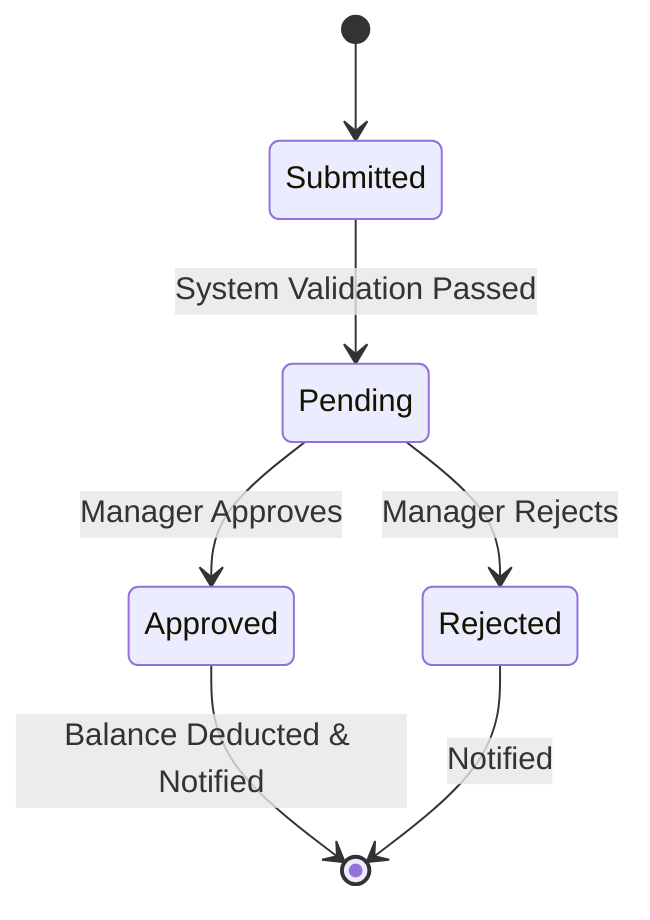
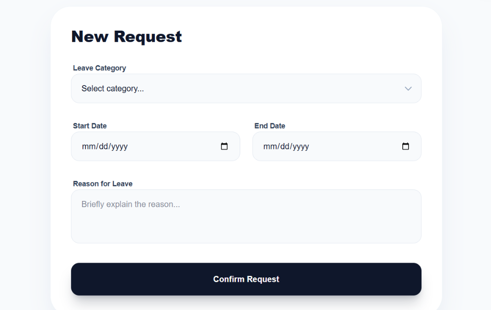
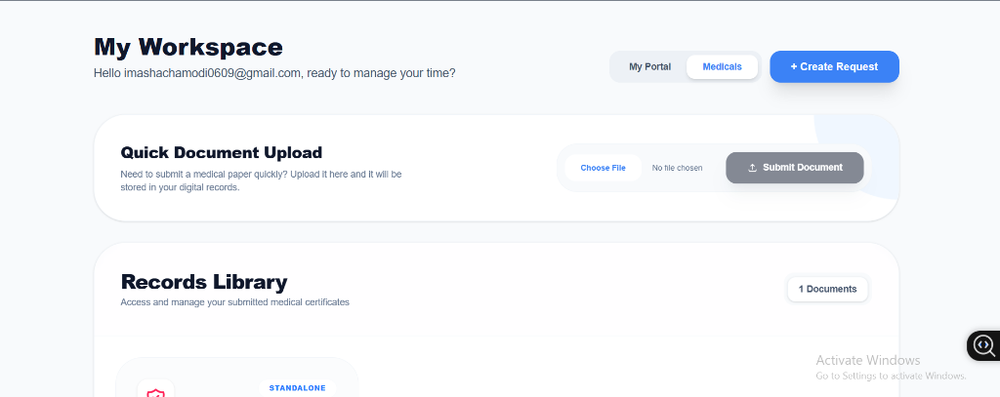
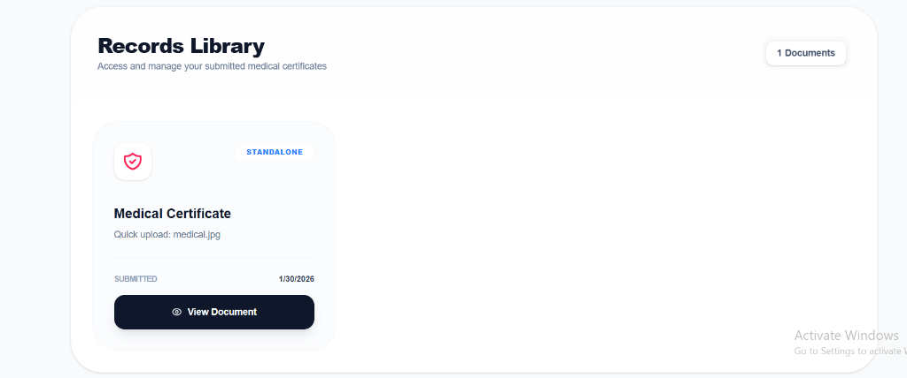
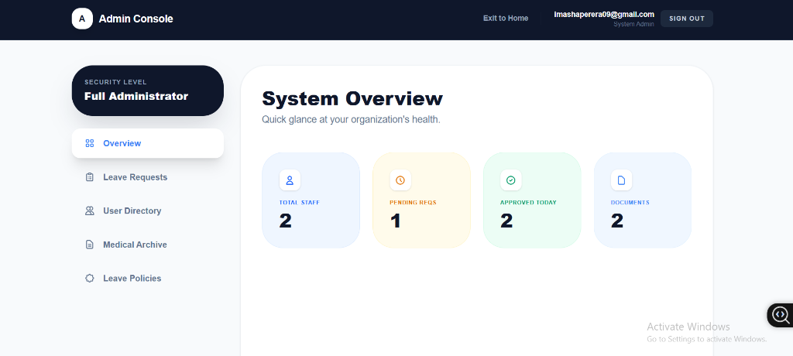
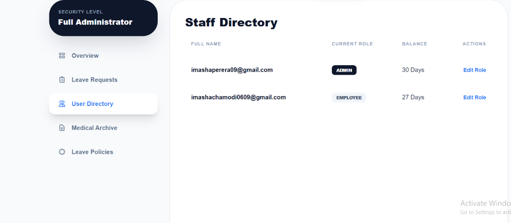
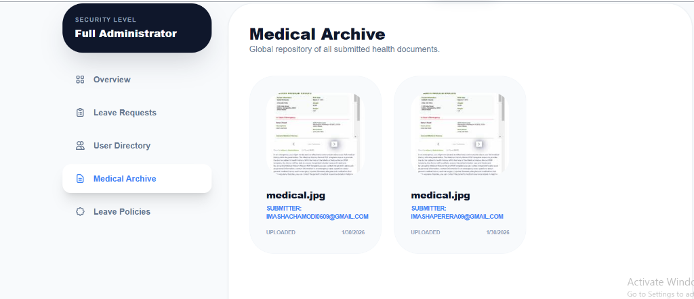
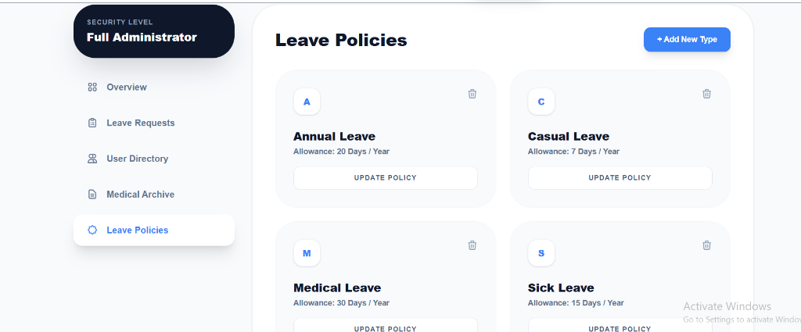

# Smart Leave - Permission Management System

Smart Leave is a modern, efficient way to track, request, and approve leaves within an organization. It features real-time balance updates, seamless communication, and role-based workflows for Employees and Managers.

## About the Project
This system is designed to streamline the connection between employees and HR/Management. It eliminates manual paperwork by providing a digital, real-time interface for all leave-related activities.

### Key Features
- **Role-Based Access**: Distinct portals for Employees, Managers, and Admins.
- **Real-Time Balance Tracking**: Automatic calculation of used and remaining leave days.
- **Smart Validation**: Prevents overlapping requests and insufficient balance errors.
- **Medical Archive**: Secure upload and storage system for medical certificates.
- **Admin Console**: Full control over user roles, leave policies, and system settings.

## Technical Stack
The project is built using a robust, modern high-performance technology stack:

| Component | Technology | Description |
|-----------|------------|-------------|
| **Frontend** | React 19 + Vite | Fast, responsive UI with modern React hooks and state management. |
| **Styling** | Tailwind CSS v4 | Utility-first CSS framework for a premium, responsive design. |
| **Backend** | .NET Core Web API (C#) | High-performance server handling business logic and API endpoints. |
| **Database** | Supabase (PostgreSQL) | Scalable relational database with real-time capabilities. |
| **Auth** | Supabase Auth | Secure user authentication and session management. |

> **Note**: Database URLs and API Keys (e.g., `SUPABASE_URL`, `SUPABASE_ANON_KEY`) are sensitive. They should be configured in your local environment variables (e.g., `.env` file) and **never** committed directly to the `README.md` or public repositories.

## System Architecture
High-level overview of the system components and data flow:

## Leave Request Workflow
The lifecycle of a leave request within the system:

## Employee Interface

Here is a comprehensive look at the **Employee Interface**. All the screenshots below represent the view and functionalities available to regular employees.

### Landing Page
The simplified landing page allows quick access to the portal or admin workspace.

### Employee Dashboard
The "My Workspace" dashboard gives a clear overview of leave balances, approved requests, and pending applications.

### Request History
Employees can view the status of their leave applications (Pending, Approved, Rejected) in a clean list view.

### New Leave Request
A streamlined form for submitting new leave requests.

### Medicals & Documents
A dedicated section for uplifting medical documents and managing records.

## Admin Interface

The Admin Console provides a comprehensive suite of tools for managing the organization's leave system.

### System Overview
A high-level view of the organization's health, including total staff, pending requests, and today's stats.

### Manage Requests
Admins can review, approve, or reject leave applications with a single click.

### User Directory
Manage user roles (promote to Admin/Manager) and view leave balances for all staff.

### Medical Archive
A central repository for all submitted medical documents, allowing admins to verify sick leave claims.

### Leave Policies
Configure leave types and allowances (e.g., set Annual Leave to 20 days).

