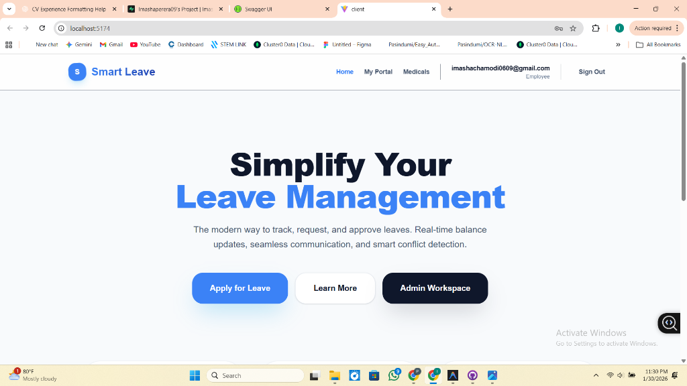
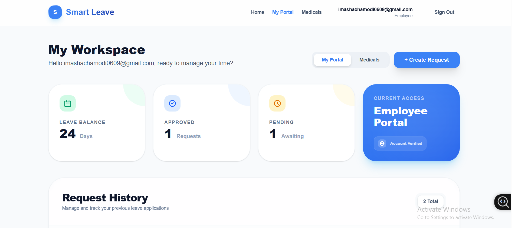
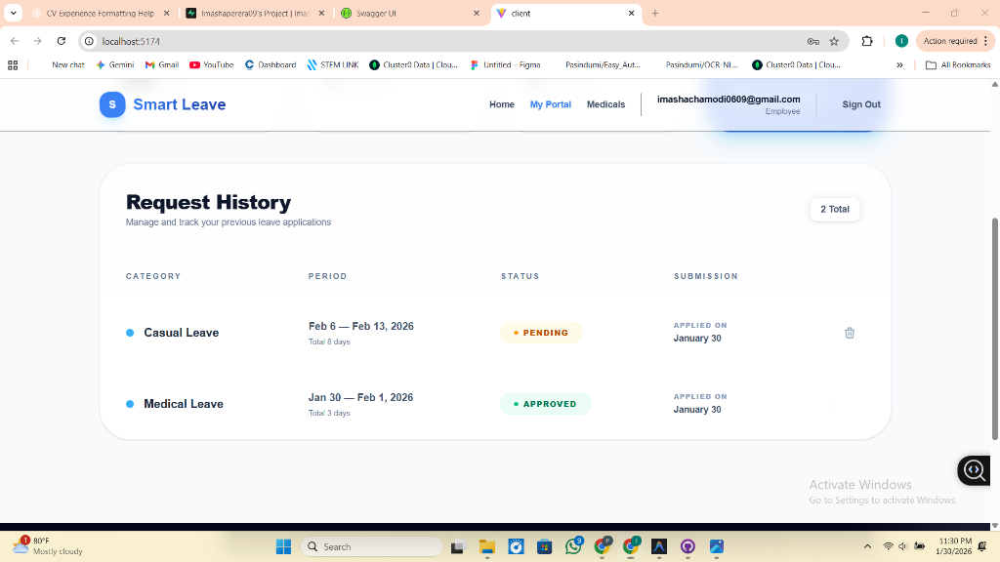
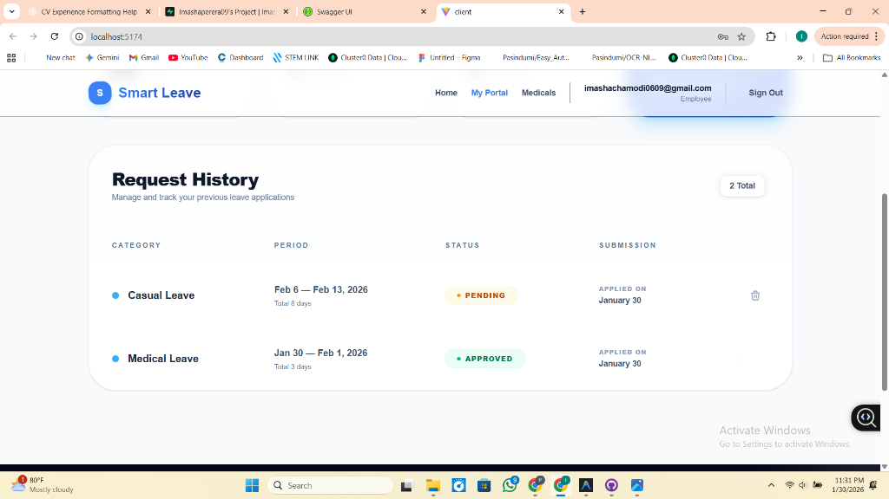
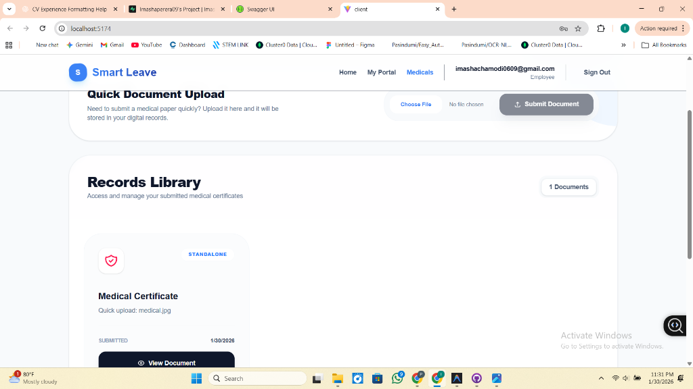

# Smart Leave - Permission Management System

Smart Leave is a modern, efficient way to track, request, and approve leaves within an organization. It features real-time balance updates, seamless communication, and role-based workflows for Employees and Managers.

## Employee Interface

Here is a glimpse of the Employee Portal, designed for simplicity and ease of use.

### Landing Page
The simplified landing page allows quick access to the portal or admin workspace.

### Employee Dashboard
The "My Workspace" dashboard gives a clear overview of leave balances, approved requests, and pending applications.

### Request History
Employees can view the status of their leave applications (Pending, Approved, Rejected) in a clean list view.

### Medicals & Documents
A dedicated section for uploading and managing medical certificates/documents.

